# 1-1.자료구조/알고리즘의 정의와 중요성


## 자료구조 (Data Structures)

- 숫자, 문자열, 값 자체, 자료들간의 관계를 포함한다.

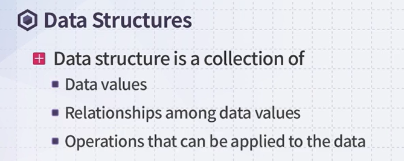

## 추상화(Abstraction)

- 수많은 정보들 가운데 어떤 문제를 해결하기 위해서 필수적인 요소만 남겨놓은 채 디테일한 내용을 제거시키는 과정

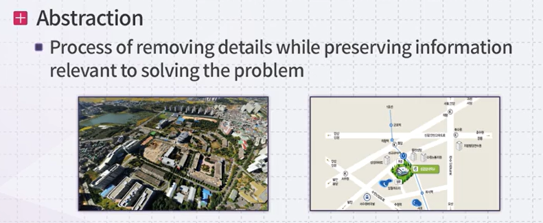

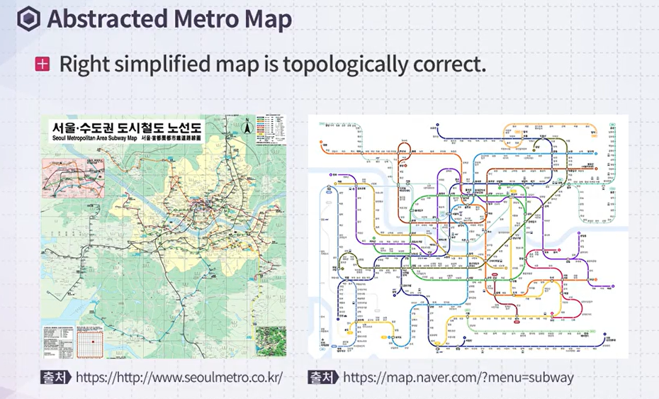

- 실제 지도보다 오른쪽 지도가 훨씬 사용자가 더 유용하게 느낀다. (추상화된 맵)


# 자료구조

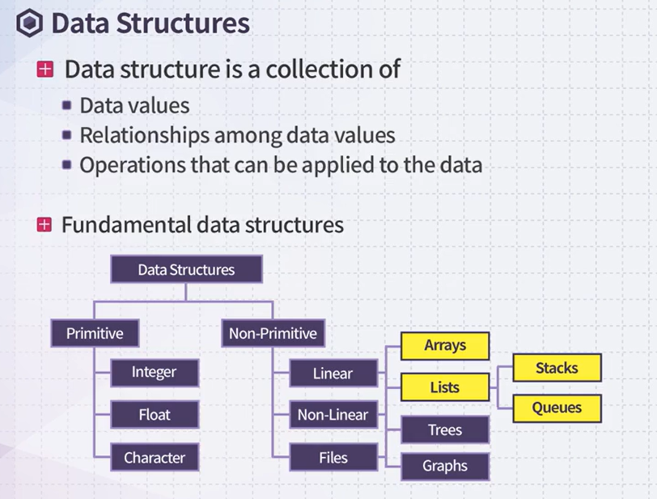

필수적 자료구조 : int, float, chr

비필수적 자료구조 : 선형(배열, 리스트(스택, 큐)), 비선형(트리, 그래프), files


- 자료에 적합한 자료구조를 선택할 줄 알아야 한다. 

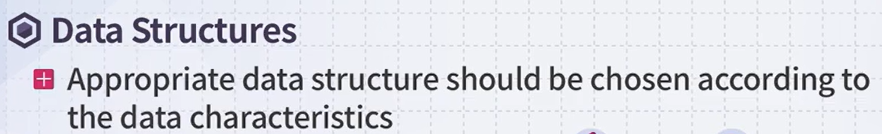

> 1_ Array

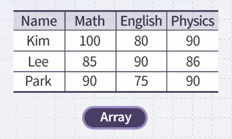

ex) 예를 들어 성적자료가 있다면, array 형태가 적합한 자료구조라는 것을 캐치할 줄 알아야 한다.

> 2_ Tree

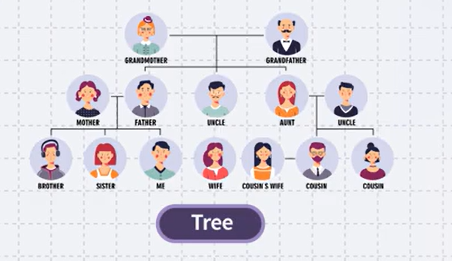

> 3_Graph

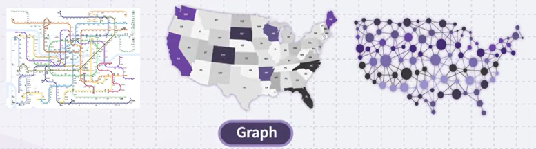


```
> 데이터에 따라 부적합한 자료구조를 선택하게 되면, 문제를 해결하는데 그 복잡도가 더욱 더 올라가게 된다. <
```


어떤 문제와 자료들이 주어졌을 때, 이 문제를 잘 해결하기 위한 적합한 자료구조를 정하는 것이 굉장히 중요하다!!!


# 알고리즘(Algorithm)

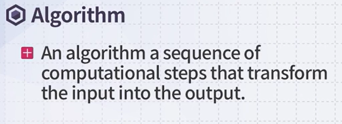

- 어떤 주어진 입력을 특정한 output으로 변환하기 위한 컴퓨터가 수행할 수 있는 작동들의 일련과정이다.


- 알고리즘은 함수와 비슷하다

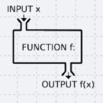

- 최대공약수 구하는 알고리즘

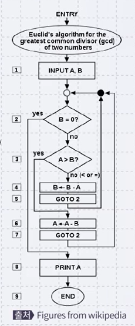

- 여기 나와있는 operation들은 모두 컴퓨터가 수행할 수 있는 것이다.


## 알고리즘의 instance

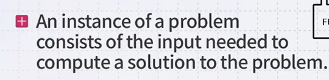

-  **instance는 어떤 특정 알고리즘의 입력이 되는 어떤 데이터**
- Instance가 가져야 되는 특징은 우리가 이 알고리즘으로 문제를 해결하기 위해서 필요한 모든 정보가 instance에 포함이 되어 있어야 한다.


> 알고리즘이 옳기 위해서 조건 2가지

1. 모든 가능한 인풋 인스턴스에 대해서 정답을 내야한다.
2. 이 알고리즘이 반드시 종료되어야 한다.


> 프로그램과 알고리즘은 같은 것일까?

- 어떻게 보면 비슷한 면도 많겠지만, 엄밀히 말하면 다르다!!
- 이유는, 프로그램은 종료가 되면 안 되는 프로그램이 있기 때문 


# 정렬문제(Sorting Problem)

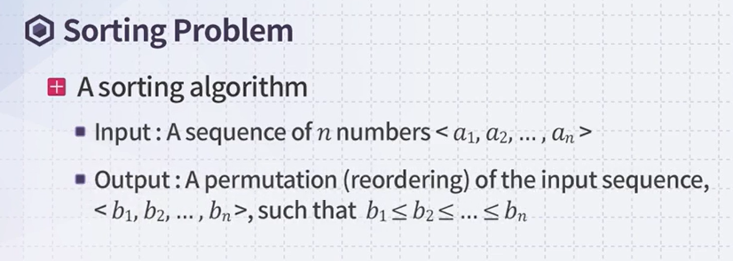

- Sorting 알고리즘이 해야할 일은 input의 순서를 재배치해서 감소하지 않는 순서로 출력을 내는 것!

- Sorting알고리즘의 instance는 input받은 숫자들의 sequence(수열)

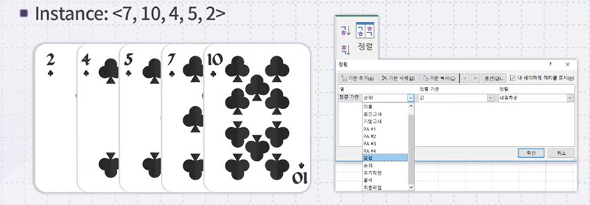


### 강좌의 목표

- 필수적인 자료구조와 알고리즘에 대한 이해도 높이기
- 프로그래밍 스킬을 늘리는 기회! (내가 이해한 무언가를 컴퓨터의 언어로 표현하는 과정)
- 라이브 코딩 세션을 통해 프로그래밍과 이해도 사이의 간극을 좁히기!
- Computational Thinking을 증대시키기!


- c++ 주 프로그래밍 언어로 수업을 진행할것(ㅠㅠ..)