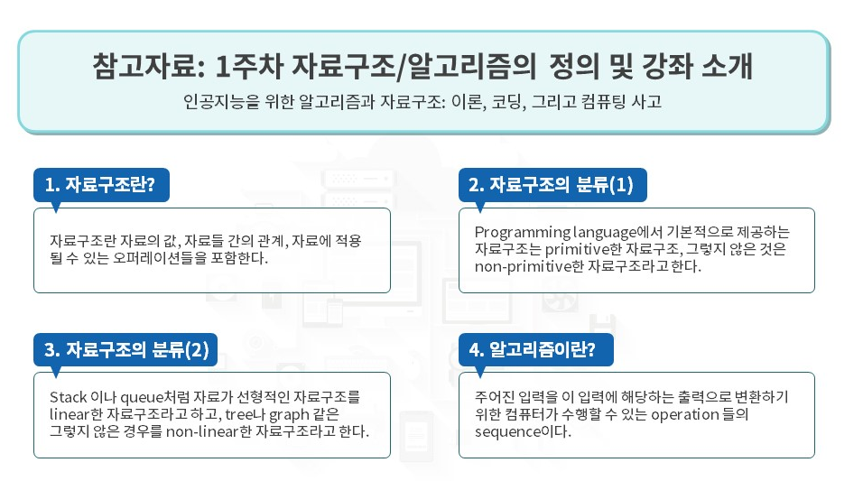

# 1-2 강좌목표와 실습환경

> 강의 주제

- 필수적인 array,list,stack,queue,heap,tree and graph

- 비선형적인 자료구조들의 탐색방법인 DFS와 BFS 라는 탐색 방법

- 알고리즘 분석하는 방법 논의

- 정렬, 최단경로, 다이내믹 프로그래밍 등..

# 선형자료구조

## 스택

## 큐

# 비선형 자료구조

## 트리

- 부모 자식 관계가 있음

## 그래프

- 트리를 일반화 한것
- 인접한 관계가 있음

# 알고리즘 분석

- 여러 알고리즘 종류 중 이 문제 해결을 위해 어떤 알고리즘이 더 적합한지 찾는 것!!

### 시간복잡도와 Weak ordering

- Weak ordering은 알고리즘들을 약하게 순서를 매겨보는것

# 최단경로

# Minimum Spanning Tree

- 왼쪽의 그래프를 오른쪽 그래프로 변환을 하는데, 저 선들 가운데 몇 개만 선택한다는 것
- 그 선택을 할 때, 숫자의 합이 최소가 되며 모든 엣지들이 다 연결되도록 선택해야함

# Topological Sort and Critical Path

- 이런 topological(위상적인) 상황에서 어떻게 sorting을 할것인가 문제를 해결해야 한다.

- ex) 선행과목 구조도 

- ex) 옷 입는 순서

# 다이나믹 프로그래밍

- 어떤 큰 문제를 작은 sub-problem들로 나누고, 각 sub-problem들을 해결한 결과를 취합해서 최종적으로 하나으 ㅣ결과를 도출하는 알고리즘의 디자인 방법론

### 1. Interval Scheduling

ex) 회의실 사용시간 overlap없이 몇명에게 사용할 수 있게 하겠느냐

### 2. Edit distance

- 두 문자열이 주어졌을 때, A문자열을 B문자열로 변환하는데 몇 번의 수정이 필요한가
- 수정이라는 것은 1. 한글자를 다른글자로 치환하던지, 2. 한글자를 빼던지 3. 한글자를 삽입하던지 하는 editing
- 다이나믹 프로그래밍을 통해 어떤 두 문자열을 최소 몇번만에 변환할 수 있을까를 해결하려고 하는 것

ex) 검색창 타이핑 오타의 근간은 edit distance이다.

### 3. Matrix Chain Multilication

- 주로 머신러닝 딥러닝 분야에서 많이 쓰임
- 곱셈의 경우, 순서를 다르게 해도 결과는 변함이 없다. (결합법칙)
- 어떤 순서대로 매트릭스를 곱하면, 계산량을 최소화 할수 있을까?

# 참고자료

