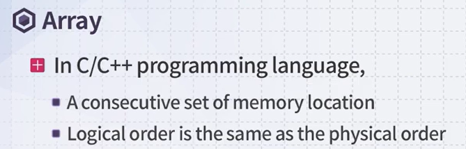

# 2-1 배열과 리스트


- array는 자료의 값들을 모아 놓은 자료구조이다.

- 각각의 자료를 모아서 index로 지칭할 수 있다. 

- 프로그래밍 언어마다 index는 0 또는 1부터 시작할 수 있는데, 보통 java, c++, python 모두 0부터 시작한다. 

> c++ array 예시




- array를 사용하겠다고 하면, 메모리 공간을 할당받게 되고, 메모리 상에 같은 순서로 매핑되어 있다. 
- array생성방법은 2가지 있다. 


- 음.. 위는 c++언어 관련 내용이다.


## 1차원 배열


- 파이썬에서는 어떻게 만들 수 있을까?

  ```python
  arr = [0] * 10
  ```

  - 파이썬은 데이터타입을 지정해주지 않아도 된다.

## 2차원 배열


- 파이썬으로는?

  ```python
  arr = [[0]*4 for _ in range(3)]
  ```

  으로 생성할 수 있을 것 같다!


- 위 그림의 포인트 : array를 선언하게 되면, 물리적인 ram에서도 연속적인 공간을 할당받게 된다. 


- 포인터는 메모리의 주소를 저장하는 변수이다.


 

