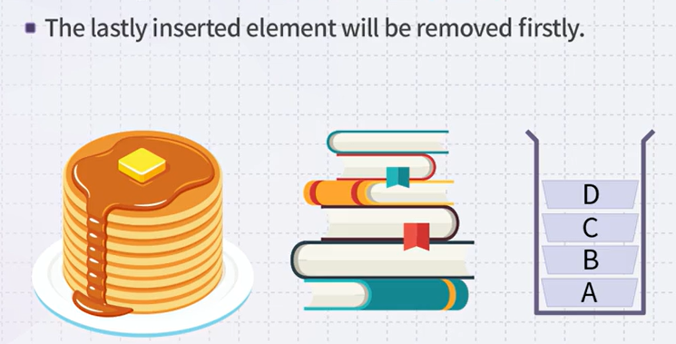

# 스택과 큐

## 스택 

- LIFO 마지막에 들어간 것이 제일 처음 나온다.

- a - b - c- d 순서로 들어갔지만, 나올때는 d- c- b- a 순서로 나오게 된다.

- 스택의 주요 특징은 삽입과 삭제가 최상단 `top`에서만 이루어진다는 것이다.

스택에서 주로 사용하는 용어정리

Top:  스택의 최상단

Push : 어떤 아이템을 top위치에 하나 추가 하겠다.

Pop : 최상단에서 하나의 아이템을 빼내겠다.

- 탑 푸쉬 팝! (푸쉬와 팝은 스택의 최상단인 top에서 이루어진다.)

### 스택으로 어떤 문제를 풀 수 있을까?

ex) 괄호 열고 닫고, 매칭 하이라이팅

### 컬러풀하게 색깔~

# 큐

- FIFO

> 큐 그림

>  큐의 삽입은 뒤에서

> 큐의 삭제는 앞에서 

## 큐의 용어

- Front(head) : 삭제가 발생하는 위치
- Rear(back, tail) : 삽입이 발생하는 위치
- Enqueue : 아이템을 뒤에 삽입
- Dequeue : 앞에서 아이템을 삭제

## 선형큐

- 처음에는 front와 rear가 한곳을 가리키고 있다가,

- 2라는 값을 enqueue 하게 되면, rear가 한칸 뒤로 빠지고, 현재 front는 2를 가리키는 상황에서

- 또 7을 enque하게되면, 지금 rear위치에 7이 들어가고 rear는 또 한칸 빠지게된다.

- 그런데 여기서 deque를 하게 되면, 제일 앞에 front가 가리키고 있는 2가 밖으로 나오면서 다음 front는 7이 되는 형태 즉, 다음 서비스를 받을 친구는 7이다.

> 큐의 특징

즉, 인큐 디큐가 각각의 위치에서, 인큐는 rear위치에서 디큐는 front에서 이루어진다는 것

- 여기서 보면 rear가 array의 끝을 가리키고 있기 때문에, 이 상황에서는 앞에 분명히 2개의 공간이 있음에도 불구하고 더 이상의 데이터를 rear에 추가할 수 없는 상황이 발생한다.

- 이런 linear큐의 문제를 해결하고자 logical하게 끝을 동그랗게 붙인 circular queue 활용(공간최대활용)

- 어느시점이 되면 rear가 0, 1 인덱스로 돌아오는 형태 

- 큐는 logical하게는 선형자료구조이지만, 동그랗게 말아서 전체적으로 다 활용할 수 있는 형태로 구현한다.

# 참고자료

