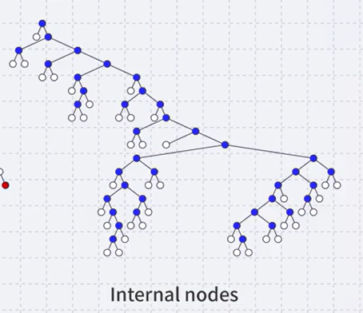

# 트리

- 노드들의 집합체
- 계층적인 관계를 나타내는 자료구조

- 뿌리노드(루트) 존재 

- 어떤 하나의 노드는 다양한 개수의 자녀들을 가질 수 있다.
- 반면에 루트를 제외한 각각의 노드는 정확하게 하나의 노드를 부모노드로 가진다.

## 트리 예시

- 디렉토리의 구조가 트리형태로 표현할 수 있는 자료이다.

# 트리 용어

모든 노드들은 0개 혹은 그 이상의 자녀 노드들을 가지고 있다. 

- 루트를 제외한 각각의 노드는 정확하게 하나의 부모노드를 가지고 있다. 

- 디그리는 노드가 가지고 있는 자녀의 숫자
- 현재 저 트리에서 I의 degree는 3이 된다. 

J,K,L 세개의 노드들은 자매노드이다.

# Leaf Node 

- leaf노드는 나무에서 잎사귀들을 얘기한다. 자녀가 더이상 없기 때문에 degree가 0인 노드들 

- 빨간색으로 표시된 부분들이 leaf 노드들이다.

# Internal Node 

- degree가 1 이상인 노드들은 internal 노드라고 부른다.

Tree는 자녀들의 순서가 있냐 없냐에 따라 구분할 수 있다. 

Unordered에서는 자녀의 순서가 무시된다.

- unordered가 일반적이나, 

- 가계도에서 첫번째 자녀 두번째 자녀 등 순서가 중요한 시점에서는 ordered 트리를 사용한다.

# Trees의 경로!

- 트리에서 경로가 정의되려면, 노드들의 sequence로 표현되었을 때, 바로 앞에 있는 노드가 그 다음 노드의 부모여야만 경로가 정의된다.

- BEG path의 길이는 2이다. 

- path의 길이는 지나가고 있는 선의 개수이다.
- 트리에서 경로는 반드시 앞의 노드가 부모노드이고, 그 다음 노드가 그 부모의 자식노드여야한다.

# 트리의 깊이

- 트리의 depth는 어떤 노드를 선택했을 때, 루트노드로부터 그 선택된 노드까지의 경로는 반드시 unique하게 하나만 존재

- 그렇지 않으면, 그 그래프는 트리가 아니게된다. 

- 여기서 k까지의 경로는 AHIK밖에 존재하지 않는다.
- 어떤 노드의 depth는 루트노드로부터 해당노드까지의 길이

- ex) 노드 E같은경우에는 A-B-E로 depth가 2가 된다.

- ex) L의 depth는 A-H-I-L  3이 된다. 

- depth순서대로 트리를 표현할 수도 있다. 

# 트리의 높이

- 노드들 가운데 가장 큰 depth가운데 가장 큰 값이 height가 된다.

- 만약 노드가 루트노드 하나만 존재한다면, 그 트리의 height는 0이 된다. 
- 왜냐면 경로의 길이가 0이고, depth도 0이기 때문

- 루트노드도 없는 empty tree같은 경우 height는 -1로 표현한다.

# 트리의 조상과 자손

- 경로가 존재한다는 말은 a가 b보다 항상 위에 존재하는 조상과 자손 

- 자기자신이 자기자신의 자손이나 부모가 되는것을 금지시킬 수 있지만, 일반적으로 자기자신을 포함하여 얘끼한다.

> B노드의 자손들

> I의 조상들

> 보라색 노드의 자손들

- 자기자신을 포함

> 보라색 노드의 조상들

- 자기자신을 포함

- 트리는 자녀노드들의 list representation을 많이 사용한다.
- linked-list같은 것들을 많이 사용한다는 말이다. 

